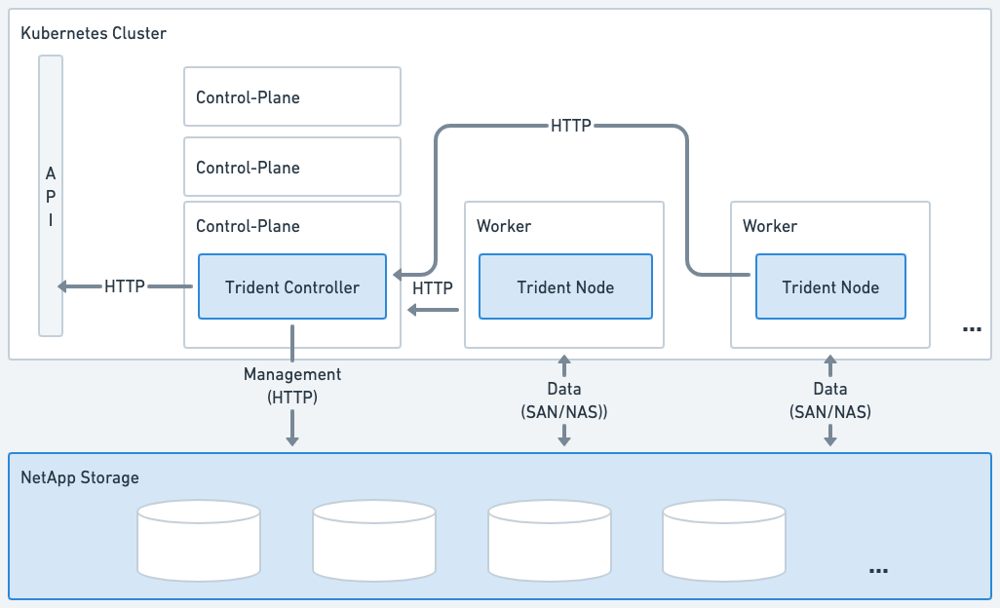

= Architettura di Trident
:hardbreaks:
:allow-uri-read: 
:icons: font
:imagesdir: ../media/

[role="lead"]
Trident viene eseguito come un singolo Controller Pod più un Node Pod su ogni nodo worker del cluster. Il Node Pod deve essere in esecuzione su qualsiasi host su cui si desidera potenzialmente montare un volume Trident.

== Comprendere i pod controller e i pod nodo

Trident si distribuisce come un singolo <<Pod del controller Trident>> e uno o più <<Pod dei nodi Trident>> sul cluster Kubernetes e utilizza i _CSI Sidecar Containers_ standard di Kubernetes per semplificare la distribuzione dei plugin CSI. link:https://kubernetes-csi.github.io/docs/sidecar-containers.html["Container Sidecar CSI Kubernetes"^] sono mantenuti dalla comunità Kubernetes Storage.

Kubernetes link:https://kubernetes.io/docs/concepts/scheduling-eviction/assign-pod-node/["selettori di nodi"^] e link:https://kubernetes.io/docs/concepts/scheduling-eviction/taint-and-toleration/["tolleranze e taint"^] sono utilizzati per vincolare un pod all'esecuzione su un nodo specifico o preferito. Puoi configurare i node selector e le toleration per i pod controller e node durante l'installazione di Trident.

* Il plugin del controller gestisce il provisioning e la gestione dei volumi, come snapshot e ridimensionamento.
* Il plugin del nodo gestisce il collegamento dello storage al nodo.

.Trident distribuito sul cluster Kubernetes

=== Pod del controller Trident

Il Pod Controller Trident è un singolo Pod che esegue il plugin CSI Controller.

* Responsabile del provisioning e della gestione dei volumi nello storage NetApp
* Gestito da un Deployment Kubernetes
* Può essere eseguito sul control-plane o sui nodi worker, a seconda dei parametri di installazione.

.Diagramma del pod del controller Trident
image::../media/controller-pod.png[Diagramma del Trident Controller Pod che esegue il plugin CSI Controller con le sidecar CSI applicabili.]

=== Pod dei nodi Trident

I Pod Trident Node sono Pod privilegiati che eseguono il plugin CSI Node.

* Responsabile del montaggio e dello smontaggio dello storage per i Pod in esecuzione sull'host
* Gestito da un Kubernetes DaemonSet
* Deve essere eseguito su qualsiasi nodo che monterà NetApp storage

.Diagramma del Node Pod di Trident
image::../media/node-pod.png[Diagramma del Pod del nodo Trident che esegue il plugin CSI Node con il relativo sidecar CSI.]

== Architetture supportate del cluster Kubernetes

Trident è supportato con le seguenti architetture Kubernetes:

[cols="3,1,2"]
|===
| Architetture del cluster Kubernetes | Supportato | Installazione predefinita 

| Master singolo, calcolo | Sì  a| 
Sì

| Master multipli, compute | Sì  a| 
Sì

| Master, `etcd`, calcolo | Sì  a| 
Sì

| Master, infrastruttura, compute | Sì  a| 
Sì

|===