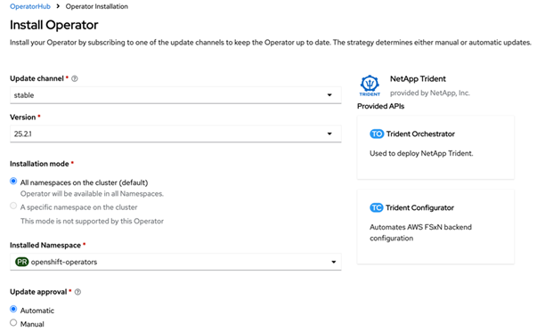

= Installare Trident utilizzando OpenShift OperatorHub
:hardbreaks:
:allow-uri-read: 
:icons: font
:imagesdir: ../media/

[role="lead"]
Se si utilizza Red Hat OpenShift, è possibile installare NetApp Trident utilizzando l'operatore certificato Red Hat. Utilizzare questa procedura per installare Trident dalla piattaforma Red Hat OpenShift Container Platform.

.Prima di iniziare
Prima di iniziare l'installazione, link:../trident-get-started/requirements.html["prepara il tuo ambiente per l'installazione di Trident"].

== Trova e installa l'operatore Trident

.Passaggi
. Naviga su OpenShift OperatorHub e cerca NetApp Trident.
+
image::../media/openshift-operator-01.png[Trident Operator]

. Fare clic su *NetApp Trident* per aprire le impostazioni di installazione.
. Seleziona le opzioni richieste e fai clic su *Install* per aprire la configurazione dell'Operator.
+
image::../media/openshift-operator-02.png[Installare]

+

NOTE: Assicurati di selezionare la versione più recente di Operator.

. Mantieni tutti i parametri così come sono e fai clic su *Install*.
+

+
Una volta completata l'installazione, l'Operator è visibile nell'elenco degli operator installati ed è pronto all'uso.

. Fare clic su *View Operator* per visualizzare i dettagli dell'Operator.
+
image::../media/openshift-operator-04.png[Installato]

. In *Trident Orchestrator*, fai clic su *Create instance*.
+
image::../media/openshift-operator-07.png[Installato]

. Fare clic su *Vista YAML* e incollare quanto segue nel modulo:
+
[source, yaml]
----
apiVersion: trident.netapp.io/v1
kind: TridentOrchestrator
metadata:
  name: trident
  namespace: openshift-operators
spec:
  IPv6: false
  debug: false
  nodePrep:
  - iscsi
  imageRegistry: ''
  k8sTimeout: 30
  namespace: trident
  silenceAutosupport: false
----
+
[]
====
** Red Hat Enterprise Linux CoreOS (RHCOS) non ha iSCSI abilitato e configurato.
** È possibile aggiungere il `nodePrep` parametro per configurare e abilitare entrambi i servizi iSCSI e Multipath su tutti i nodi worker OpenShift.
** A partire da OpenShift 4.19, la versione minima di Trident supportata per questa funzionalità è la 25.06.1.

====
. Fare clic su *Create*; il Trident Orchestrator sarà completamente installato.
+
image::../media/openshift-operator-08.png[Installato]

== Disinstallare l'operatore Trident

.Passaggi
. Seleziona l'operatore Trident dall'elenco degli operator installati.
. Seleziona se vuoi eliminare tutte le istanze dell'operando dall'operatore.
+

WARNING: Se non si seleziona la casella di controllo *Elimina tutte le istanze dell'operando da questo operatore*, Trident non verrà disinstallato.

. Fare clic su *Disinstalla*.

